# 📚 Bookia App

**Bookia** is a Flutter-based bookstore application that allows users to explore and purchase books easily.  
Users can register or log in using their email, add books to their **wishlist**, and manage their **cart** — all powered by an integrated **RESTful API**.

---

## 🚀 Features

- 🛒 Browse and purchase books directly from the app.  
- ❤️ Add or remove books from the **wishlist**.  
- 🧺 Add or remove books from the **cart**.  
- 🔍 Search for books with **debouncing** for better performance.  
- 👤 Register and log in using an email-based authentication system.  
- ⚙️ Full control over products using API endpoints.  
- 💾 Save user data locally using **SharedPreferences**.  
- 🧠 Manage app state with **Cubit** and `flutter_bloc`.  
- 💡 Modern UI with animations and smooth navigation.

---

## 🧩 Tech Stack

| Technology | Purpose |
|-------------|----------|
| **Flutter** | UI framework |
| **Dio** | API communication (HTTP requests) |
| **Cubit (flutter_bloc)** | State management |
| **SharedPreferences** | Local data storage |
| **Go Router** | Navigation and routing |
| **CachedNetworkImage** | Cached image loading |
| **DevicePreview** | Device testing and UI preview |
| **Shimmer Animation** | Loading effects |

---

## ⚙️ Installation & Setup

1. **Clone the repository**
   ```bash
   git clone 
   cd bookia
   ```

2. **Install dependencies**
   ```bash
   flutter pub get
   ```

3. **Run the app**
   ```bash
   flutter run
   ```


## 🖼️ Screenshots

### 🔐 Authentication Flow
| Splash | Welcome | Login | Register | Forget Password | OTP | Create Password | Password Changed |
|---------|----------|--------|-----------|------------------|------|------------------|------------------|
|  |  | 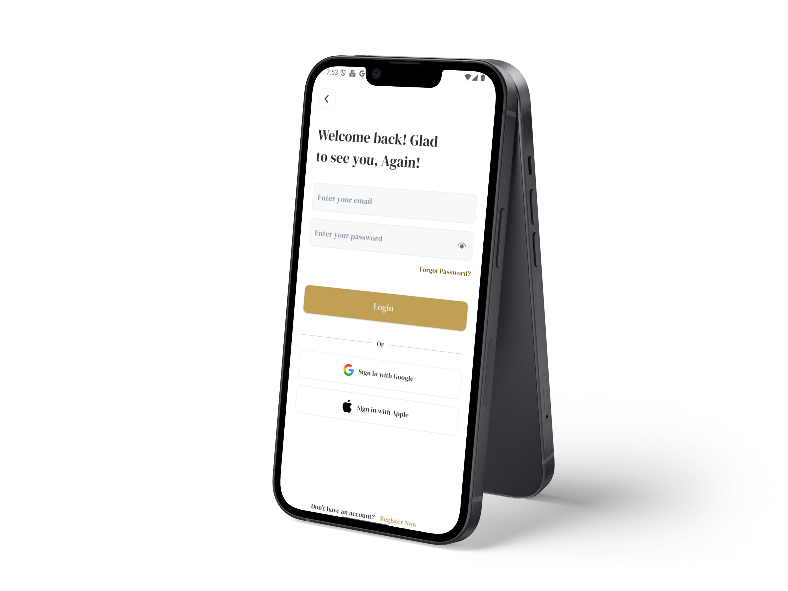 | 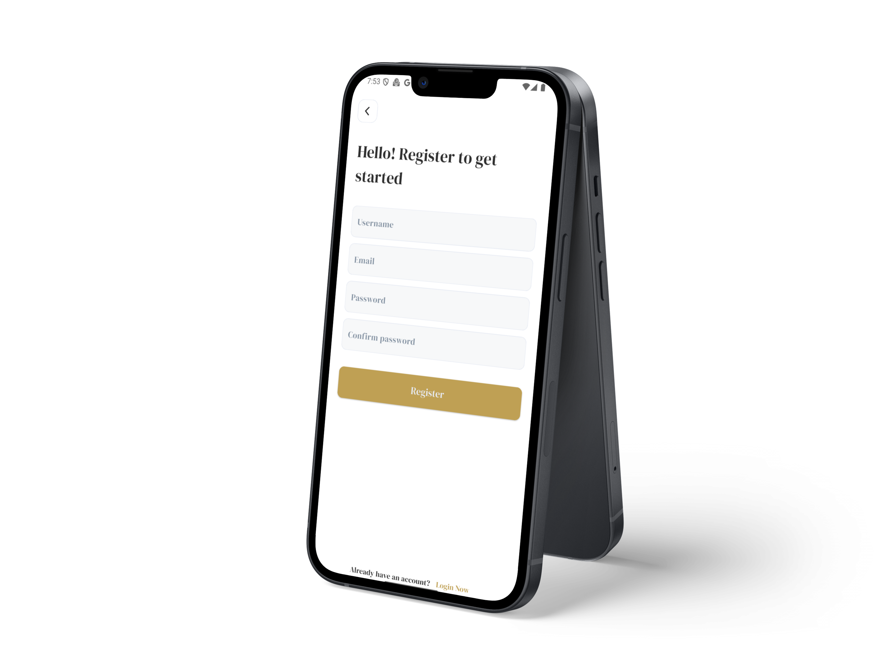 |  | 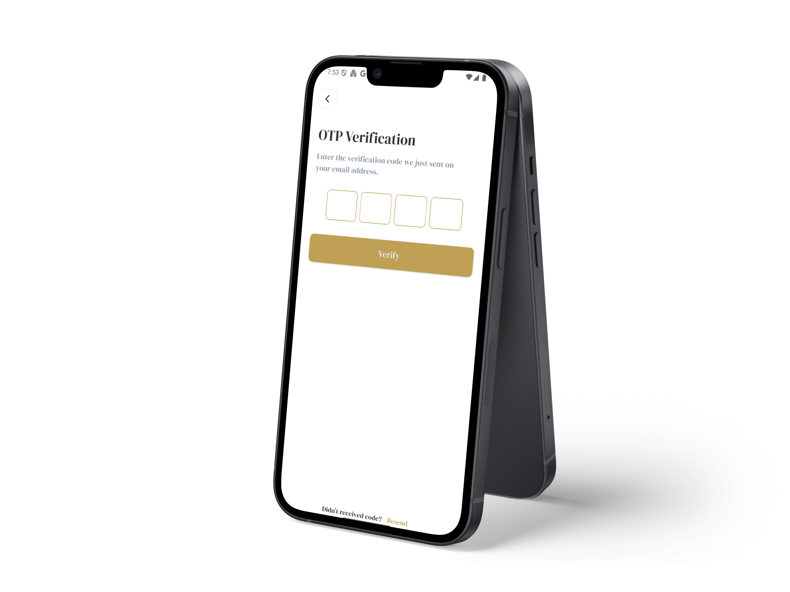 | 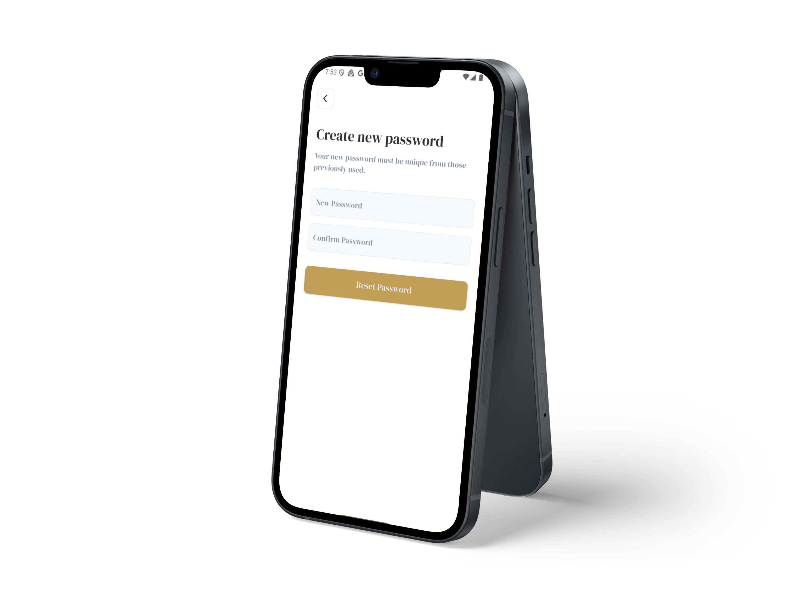 | 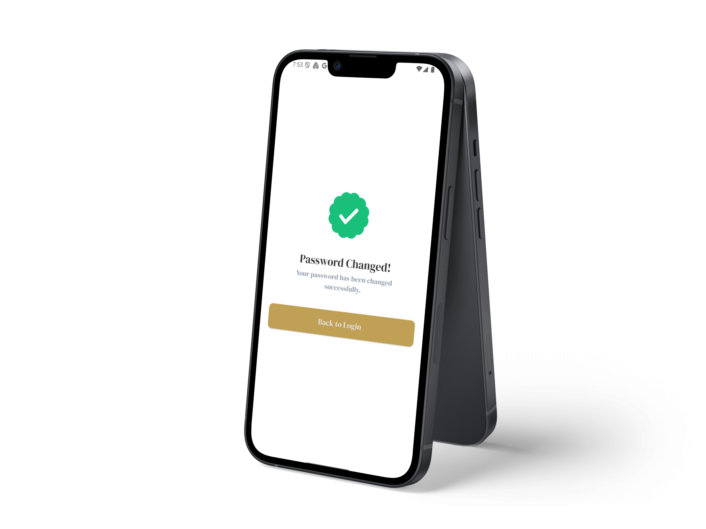 |

### 🏠 Main App Screens
| Home | Details | Wishlist | Search | Cart | Profile | My Orders | Edit Profile | Reset Password |
|------|----------|-----------|---------|------|----------|-------------|---------------|----------------|
|  |  | 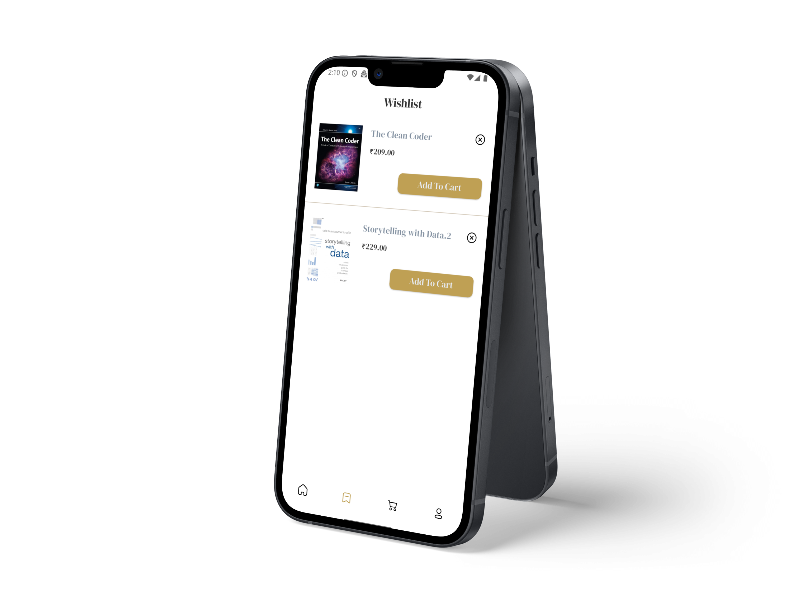 |  | 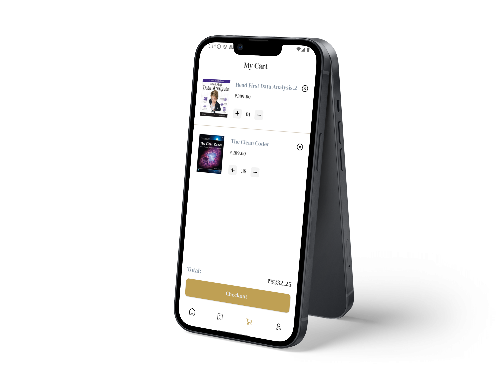 | 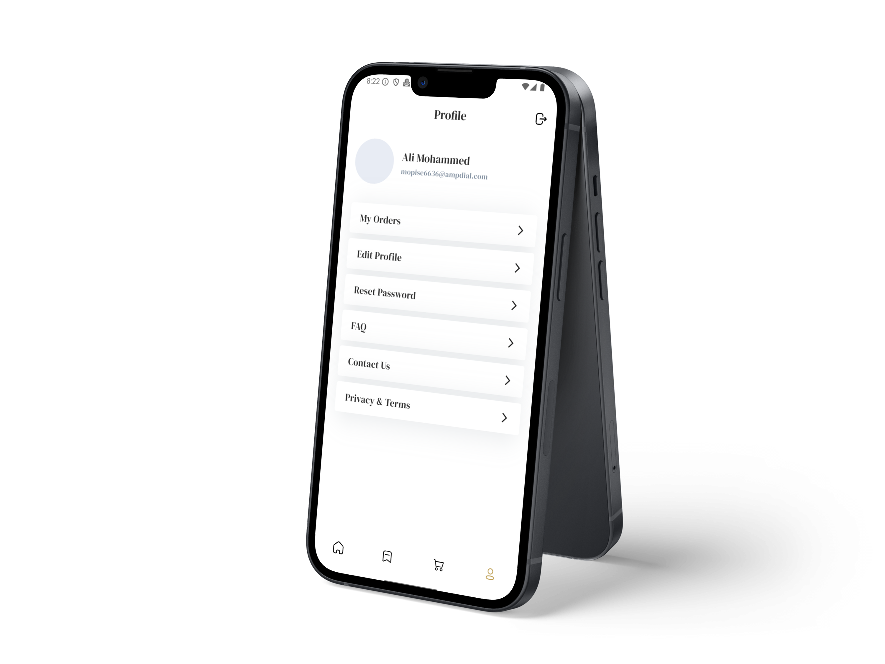 | 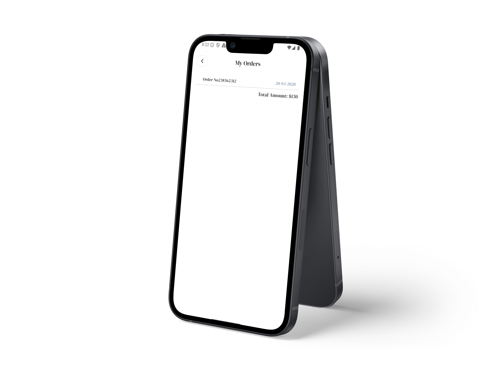 | 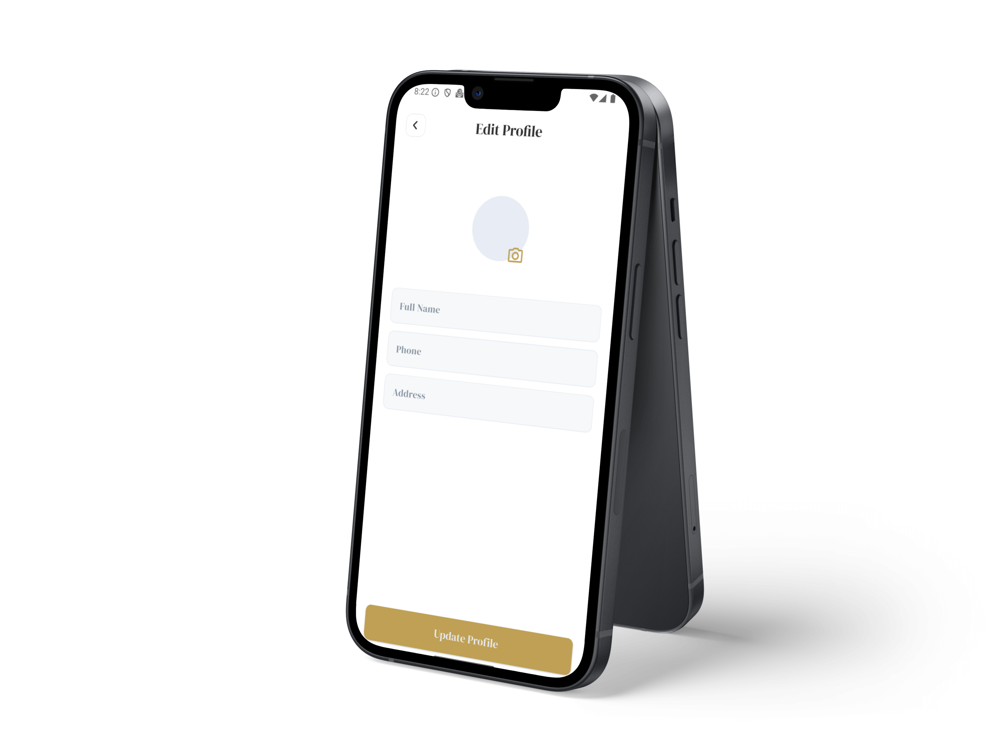 | 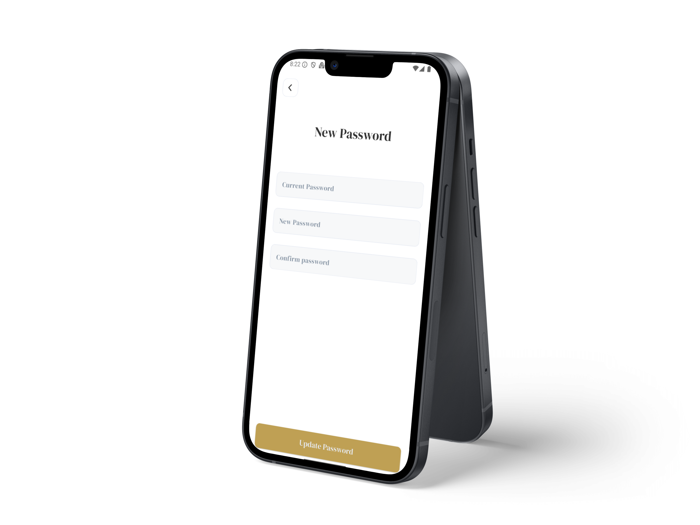 |


---

## 🏗️ Project Structure

```
lib/
 ├─ core/
 │   ├─ routes/
 │   ├─ services/
 │   ├─ utils/
 ├─ features/
 │   ├─ auth/
 │   ├─ welcome/
 │   ├─ home/
 │   ├─ wishlist/
 │   ├─ cart/
 │   ├─ profile/
 └─ main.dart
```

---

## 👨‍💻 Developer

Developed by **Mohamed Adel** ❤️  
Built with Flutter using **Clean Architecture** and **Cubit** for state management.

---

## 🪪 License

MIT License © 2025  Mohamed Adel
